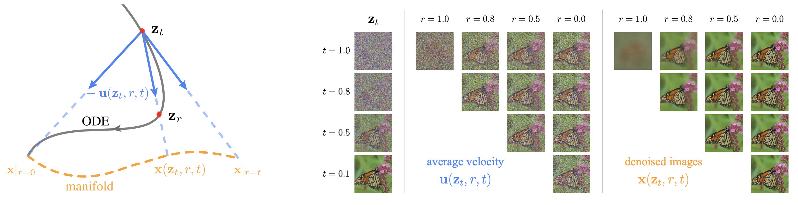

# Pixel Mean Flows

[](https://arxiv.org/abs/2601.22158)&nbsp;
[](https://opensource.org/licenses/MIT)&nbsp;
[](https://huggingface.co/Lyy0725/pMF)&nbsp;


<p align="center">
  
</p>

This is the official PyTorch re-implementation for the paper [One-step Latent-free Image Generation with Pixel Mean Flows](https://arxiv.org/abs/2601.22158), which is originally implemented with JAX+TPUs. This code is written and tested on H100 GPUs. We only provide inference code and pre-trained checkpoints in this repo. For training code, please refer to the original [JAX implementation](https://github.com/Lyy-iiis/pmf).

## Initialization

Use `requirements.txt` to install the dependencies (PyTorch+GPUs).
## Inference

You can quickly verify your setup with our provided checkpoint.
<table><tbody>
<td valign="bottom">ImageNet 256x256</td>
<td valign="bottom" align="center">pMF-B/16</td>
<td valign="bottom" align="center">pMF-L/16</td>
<td valign="bottom" align="center">pMF-H/16</td>
<tr><td align="left">pre-trained checkpoint (inference) </td>
<td align="center"><a href="https://huggingface.co/Lyy0725/pMF/blob/main/pMF-B-16.pt">download</td>
<td align="center"><a href="https://huggingface.co/Lyy0725/pMF/blob/main/pMF-L-16.pt">download</td>
<td align="center"><a href="https://huggingface.co/Lyy0725/pMF/blob/main/pMF-H-16.pt">download</td>
</tr>
<tr><td align="left">FID (this repo / original paper)</td>
<td align="center">3.15/3.12</td>
<td align="center">2.51/2.52</td>
<td align="center">2.15/2.22</td>
</tr>
<tr><td align="left">IS (this repo / original paper)</td>
<td align="center">252.9/254.6</td>
<td align="center">262.8/262.6</td>
<td align="center">267.2/268.8</td>
</tr>
</tbody></table>

<table><tbody>
<td valign="bottom">ImageNet 512x512</td>
<td valign="bottom" align="center">pMF-B/32</td>
<td valign="bottom" align="center">pMF-L/32</td>
<td valign="bottom" align="center">pMF-H/32</td>
<tr><td align="left">pre-trained checkpoint (inference) </td>
<td align="center"><a href="https://huggingface.co/Lyy0725/pMF/blob/main/pMF-B-32.pt">download</td>
<td align="center"><a href="https://huggingface.co/Lyy0725/pMF/blob/main/pMF-L-32.pt">download</td>
<td align="center"><a href="https://huggingface.co/Lyy0725/pMF/blob/main/pMF-H-32.pt">download</td>
</tr>
<tr><td align="left">FID (this repo / original paper)</td>
<td align="center">3.63/3.70</td>
<td align="center">2.69/2.75</td>
<td align="center">2.36/2.48</td>
</tr>
<tr><td align="left">IS (this repo / original paper)</td>
<td align="center">273.2/271.9</td>
<td align="center">276.0/276.8</td>
<td align="center">284.3/284.9</td>
</tr>
</tbody></table>

Note that slight differences may arise due to minor differences in JAX/PyTorch implementations and hardware.

To generate a batch of 512x512 images using the pMF-H/32 model (for visualization only), run:

```bash
python evaluate.py sample \
--ckpt-path /path/to/H/32/checkpoint.pth \
--workdir ./visualize \
--model pmfDiT_H_32 \
```

To evaluate the FID of the pMF-B/16 model on ImageNet 256x256, run:

```bash
torchrun --nproc-per-node=8 evaluate.py evaluate \
--ckpt-path /path/to/B/16/checkpoint.pth \
--workdir ./b16_fid_output
```

To evaluate the FID of the pMF-L/16 model on ImageNet 256x256, run:

```bash
torchrun --nproc-per-node=8 evaluate.py evaluate \
--ckpt-path /path/to/L/16/checkpoint.pth \
--workdir ./l16_fid_output \
--model pmfDiT_L_16 \
--cfg-omega 7.0 \
--interval-min 0.2 \
--interval-max 0.7
```

To evaluate the FID of the pMF-H/16 model on ImageNet 256x256, run:

```bash
torchrun --nproc-per-node=8 evaluate.py evaluate \
--ckpt-path /path/to/H/16/checkpoint.pth \
--workdir ./h16_fid_output \
--model pmfDiT_H_16 \
--cfg-omega 7.0 \
--interval-min 0.2 \
--interval-max 0.6
```

To evaluate the FID of the pMF-B/32 model on ImageNet 512x512, run:

```bash
torchrun --nproc-per-node=8 evaluate.py evaluate \
--ckpt-path /path/to/B/32/checkpoint.pth \
--workdir ./b32_fid_output \
--model pmfDiT_B_32 \
--cfg-omega 6.5 \
--interval-min 0.1 \
--interval-max 0.7
```

To evaluate the FID of the pMF-L/32 model on ImageNet 512x512, run:

```bash
torchrun --nproc-per-node=8 evaluate.py evaluate \
--ckpt-path /path/to/L/32/checkpoint.pth \
--workdir ./l32_fid_output \
--model pmfDiT_L_32 \
--cfg-omega 7.5 \
--interval-min 0.2 \
--interval-max 0.6
```

To evaluate the FID of the pMF-H/32 model on ImageNet 512x512, run:

```bash
torchrun --nproc-per-node=8 evaluate.py evaluate \
--ckpt-path /path/to/H/32/checkpoint.pth \
--workdir ./h32_fid_output \
--model pmfDiT_H_32 \
--cfg-omega 5.5 \
--interval-min 0.1 \
--interval-max 0.6
```


You may use the `--save-samples` option to keep the sampled images after FID evaluation is finished. Otherwise, they will automatically be removed.

For FID evaluation, we use the pre-computed reference file from [JiT](https://github.com/LTH14/JiT).

## License

This repo is under the MIT license. See [LICENSE](./LICENSE) for details.

## Citation

If you find this work useful in your research, please consider citing our paper :)

```bib
@article{pixelmeanflows,
  title={One-step Latent-free Image Generation with Pixel Mean Flows},
  author={Lu, Yiyang and Lu, Susie and Sun, Qiao and Zhao, Hanhong and Jiang, Zhicheng and Wang, Xianbang and Li, Tianhong and Geng, Zhengyang and He, Kaiming},
  journal={arXiv preprint arXiv:2601.22158},
  year={2026}
}
```

## Contributors

This repository is a collaborative effort by Kaiming He, Hanhong Zhao, Qiao Sun and Yiyang Lu, developed in support of several research projects, including [MeanFlow](https://arxiv.org/abs/2505.13447), [improved MeanFlow](https://arxiv.org/abs/2512.02012), and [BiFlow](https://arxiv.org/abs/2512.10953).

## Acknowledgement

We gratefully acknowledge the Google TPU Research Cloud (TRC) for granting TPU access. A portion of codes in this repo is based on [JiT](https://github.com/LTH14/JiT).
We hope this work will serve as a useful resource for the open-source community. 
